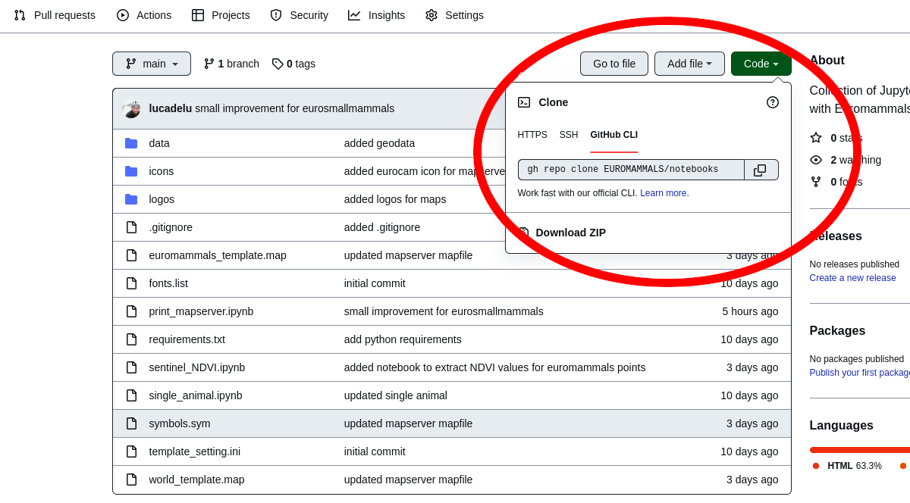

This repository contains several documents to run in Jupyter Notebook that can be useful for Euromammals members.

## How to use the notebooks

### Download the repository

Download the repository, you can use [Git](https://git-scm.com/), [Github command line](https://cli.github.com/) or the [`Download ZIP`](https://github.com/EUROMAMMALS/notebooks/archive/refs/heads/main.zip) button

### Install the needed softwares

Enter in the `notebooks` directory and install [Virtualenv](https://virtualenv.pypa.io/en/latest/), a tool to create isolated Python environments.

At this point you need to set up a new Python 3 (be sure that the default Python version is >= 3) environment and activate it with the following code.

    virtualenv venv
    source venv/bin/activate

The next steps is to install all the Python libraries need by the different notebooks

    pip install -r requirements.txt

### Start Jupyter Notebook

When you have installed all the needed software you can finally start Jupyter Notebook

    jupyter-notebook

and select the notebook (`ipynb` files) that you want to run.

For more info about Jupyter Notebook you can read the related [documentation](https://docs.jupyter.org/en/latest/)
